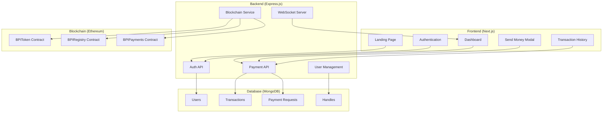
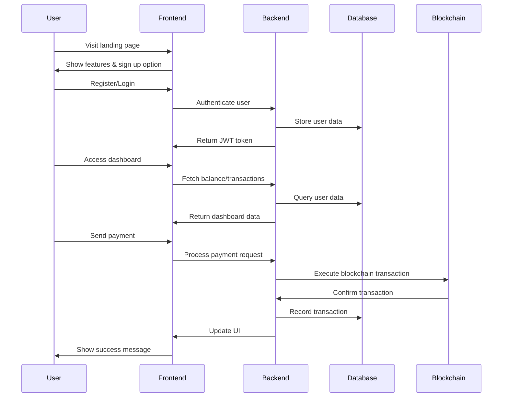

# BPI - Blockchain Payment Interface


[](https://nodejs.org/)
[](https://soliditylang.org/)
[](https://nextjs.org/)

A decentralized payment interface that enables secure, borderless transactions using blockchain technology. BPI allows users to send and receive money globally without traditional banking intermediaries, powered by Ethereum smart contracts and a modern web interface.

## 🌟 Key Features

- **🔐 Secure by Design**: Blockchain-powered transactions with immutable records
- **⚡ Lightning-Fast**: Near-instant payment settlements across borders
- **🌍 Global Reach**: Send money anywhere without banking restrictions
- **👤 Handle-Based Payments**: User-friendly @handle system for easy transactions
- **📊 Real-Time Dashboard**: Track balances, transactions, and payment history
- **🔔 Instant Notifications**: Real-time updates via WebSocket connections
- **💰 Multi-Currency Support**: Built on ERC-20 token standard
- **🔄 Payment Requests**: Request money from others with expiration controls

## 🏗️ Architecture



## 🛠️ Tech Stack

### Frontend
- **Framework**: Next.js 15 with TypeScript
- **Styling**: Tailwind CSS
- **Animations**: Framer Motion
- **UI Components**: HeroUI, Radix UI
- **State Management**: React Query (TanStack)
- **Icons**: Lucide React

### Backend
- **Runtime**: Node.js 18+
- **Framework**: Express.js
- **Database**: MongoDB with Mongoose
- **Authentication**: JWT with bcryptjs
- **Real-time**: Socket.io
- **Validation**: Joi
- **Security**: Helmet, CORS, Rate Limiting

### Blockchain
- **Language**: Solidity 0.8.20
- **Framework**: Hardhat
- **Libraries**: OpenZeppelin Contracts
- **Network**: Ethereum (configurable)
- **Token Standard**: ERC-20

### DevOps & Tools
- **Testing**: Jest
- **Linting**: ESLint
- **Process Management**: Nodemon
- **API Documentation**: RESTful APIs
- **Version Control**: Git

## 📋 Prerequisites

Before running this project, make sure you have the following installed:

- **Node.js** (v18 or higher)
- **npm** or **yarn**
- **MongoDB** (local or cloud instance)
- **MetaMask** or similar Web3 wallet (for blockchain interactions)
- **Git**

## 🚀 Installation & Setup

### 1. Clone the Repository

```bash
git clone https://github.com/your-username/bpi-blockchain-payment-interface.git
cd bpi-blockchain-payment-interface
```

### 2. Environment Setup

Create environment files for both frontend and backend:

```bash
# Backend environment
cp bpi-backend/.env.example bpi-backend/.env
# Frontend environment
cp bpi-frontend/.env.example bpi-frontend/.env
```

Configure the following variables:

**Backend (.env):**
```env
PORT=5000
MONGODB_URI=mongodb://localhost:27017/bpi
JWT_SECRET=your-super-secret-jwt-key
FRONTEND_URL=http://localhost:3000
BLOCKCHAIN_RPC_URL=https://sepolia.infura.io/v3/YOUR_INFURA_KEY
BLOCKCHAIN_PRIVATE_KEY=your-private-key
```

**Frontend (.env.local):**
```env
NEXT_PUBLIC_API_URL=http://localhost:5000/api
NEXT_PUBLIC_BLOCKCHAIN_NETWORK=sepolia
```

### 3. Install Dependencies

```bash
# Install root dependencies
npm install

# Install backend dependencies
cd bpi-backend
npm install

# Install frontend dependencies
cd ../bpi-frontend
npm install

# Return to root
cd ..
```

### 4. Start MongoDB

Make sure MongoDB is running on your system:

```bash
# On macOS with Homebrew
brew services start mongodb/brew/mongodb-community

# On Ubuntu/Debian
sudo systemctl start mongod

# Or use Docker
docker run -d -p 27017:27017 --name mongodb mongo:latest
```

### 5. Deploy Smart Contracts (Optional for development)

If you want to deploy contracts to a testnet:

```bash
cd bpi-backend
npm run compile
npm run deploy
```

Update the contract addresses in your environment variables.

### 6. Start the Application

```bash
# Start backend (from root directory)
npm run dev:backend

# In another terminal, start frontend
npm run dev:frontend

# Or start both simultaneously
npm run dev
```

The application will be available at:
- **Frontend**: http://localhost:3000
- **Backend API**: http://localhost:5000
- **Health Check**: http://localhost:5000/health

## 📖 Usage

### User Flow



### Key User Journeys

1. **New User Registration**
   - Visit landing page
   - Click "Create Account"
   - Fill registration form
   - Verify email (if implemented)
   - Set up BPI handle

2. **Making a Payment**
   - Login to dashboard
   - Click "Make a Payment"
   - Enter recipient's @handle
   - Specify amount and memo
   - Confirm transaction
   - Receive confirmation

3. **Requesting Payment**
   - Access dashboard
   - Use "Request Money" feature
   - Enter payer's @handle
   - Set amount and expiration
   - Send request
   - Track request status

## 🔗 API Documentation

### Authentication Endpoints

| Method | Endpoint | Description |
|--------|----------|-------------|
| POST | `/api/auth/register` | User registration |
| POST | `/api/auth/login` | User login |
| POST | `/api/auth/logout` | User logout |
| GET | `/api/auth/me` | Get current user info |

### Payment Endpoints

| Method | Endpoint | Description |
|--------|----------|-------------|
| POST | `/api/payment/send` | Send payment to handle |
| POST | `/api/payment/request` | Request payment from user |
| PUT | `/api/payment/request/:id/approve` | Approve payment request |
| DELETE | `/api/payment/request/:id` | Cancel payment request |
| GET | `/api/payment/transactions` | Get user transactions |
| GET | `/api/payment/balance` | Get user balance |

### User Management

| Method | Endpoint | Description |
|--------|----------|-------------|
| GET | `/api/user/profile` | Get user profile |
| PUT | `/api/user/profile` | Update user profile |
| POST | `/api/user/handle` | Set BPI handle |

## 📄 Smart Contracts

### BPIToken.sol
ERC-20 token contract for BPI payments (tINR - test INR token).

**Key Features:**
- Minting and burning capabilities
- Pausable transfers
- Role-based access control
- Maximum supply limits

**Main Functions:**
- `mint(address to, uint256 amount)` - Mint tokens
- `burn(uint256 amount)` - Burn tokens
- `transfer(address to, uint256 amount)` - Transfer tokens

### BPIRegistry.sol
Handle registry for user-friendly payment addresses.

**Key Features:**
- Handle-to-address mapping
- Reverse lookups (address-to-handle)
- Handle uniqueness validation
- Ownership management

**Main Functions:**
- `registerHandle(string handle)` - Register a new handle
- `resolveHandle(string handle)` - Get address for handle
- `addressToHandle(address addr)` - Get handle for address

### BPIPayments.sol
Core payment processing contract.

**Key Features:**
- Handle-based payments
- Payment requests with expiration
- Fee collection system
- Emergency recovery functions

**Main Functions:**
- `payByHandle(string toHandle, uint256 amount, bytes32 memoHash)` - Send payment
- `requestPayment(string payerHandle, uint256 amount, bytes32 memoHash, uint256 expirationHours)` - Request payment
- `approvePaymentRequest(uint256 requestId)` - Approve payment request

## 🧪 Testing

```bash
# Run backend tests
cd bpi-backend
npm test

# Run frontend tests (if implemented)
cd ../bpi-frontend
npm test
```

## 🤝 Contributing

We welcome contributions! Please follow these steps:

1. Fork the repository
2. Create a feature branch: `git checkout -b feature/amazing-feature`
3. Commit your changes: `git commit -m 'Add amazing feature'`
4. Push to the branch: `git push origin feature/amazing-feature`
5. Open a Pull Request

### Development Guidelines

- Follow the existing code style
- Write clear, concise commit messages
- Add tests for new features
- Update documentation as needed
- Ensure all tests pass before submitting PR

## 📝 License

This project is licensed under the MIT License - see the [LICENSE](LICENSE) file for details.

## 🙏 Acknowledgments

- [OpenZeppelin](https://openzeppelin.com/) for secure smart contract libraries
- [Next.js](https://nextjs.org/) for the amazing React framework
- [Ethereum](https://ethereum.org/) for the blockchain infrastructure
- [MongoDB](https://www.mongodb.com/) for the database solution

## 📞 Support

If you have any questions or need help:

- Open an issue on GitHub
- Check the documentation
- Join our Discord community

---

**Built with ❤️ for a decentralized financial future**
